# Key Management System (KMS) with Encrypt/Decrypt using NodeJS, Encrypt uploaded file with PHP

## Two objectives:

- Use [Amazon KMS](https://docs.aws.amazon.com/encryption-sdk/latest/developer-guide/js-examples.html) in JS/NodeJS to encrypt/decrypt a string
- Use KMS again to upload file (image) to Amazon S3 using PHP.

### About Amazon KMS and S3
You need to pay to use KMS and S3.  Yes, it costs money.

### About PHP upload to S3 using KMS

I managed to do it all in a single `index.php` file.  Most of the PHP upload code should be familiar to you.

#### Include all necessary packages:

```
<?php
require_once("vendor/autoload.php");

use Aws\S3\S3Client;
use Aws\S3\Crypto\S3EncryptionClient;
use Aws\Kms\KmsClient;
use Aws\Crypto\KmsMaterialsProvider;

use Aws\Exception\AwsException;
use Dotenv\Dotenv;

$dotenv = Dotenv::createImmutable(__DIR__);
$dotenv->load();
?>
```

About Amazon S3, please note that instead of using `new S3Client($sharedOptions);`, I added an additional wrapper called `S3EncryptionClient`: `new S3EncryptionClient(new S3Client($sharedOptions));`.  `$sharedOptions` is a normal array.  Please refer to the code for details.

In order to use KMS, you need to define `KmsClient` and `KmsMaterialsProvider`, with your `$kmsKeyArn` value defined in `.env`, all in a line:

`new KmsMaterialsProvider(new KmsClient($sharedOptions), $kmsKeyArn);`

As you can see, I am using `.env`, which means I am also using [phpdotenv](https://github.com/vlucas/phpdotenv).

After that you just use the usual `putObject([])` function to upload your file:

```
$result = $encryptionClient->putObject([
    '@MaterialsProvider' => $materialsProvider,
    '@CipherOptions' => $cipherOptions,
    'Bucket' => S3BUCKETNAME,
    'Key' => $target_file,
    'Body' => "",
    'SourceFile' => $target_file
]);
```

In case you don't know where to find some of the variables, don't panic.  Everything is in the `index.php` file.

Once completed, go to your Amazon S3 bucket and find your file.

### KMS Basic

- `GeneratorKeyId`: This key is used to generate a data key.
- [`KeyId`](https://docs.aws.amazon.com/kms/latest/developerguide/concepts.html#key-id): Key identifiers **act as names** for your AWS KMS customer master keys (CMKs). They help you to recognize your CMKs in the console. You use them to indicate which CMKs you want to use in AWS KMS API operations, IAM policies, and grants.
- Customer master keys (CMKs) [(source)](https://docs.aws.amazon.com/kms/latest/developerguide/concepts.html#master_keys) is the master key which is used to create other key.
- Why there are so many keys?  How does it all works?  Simply put:
  - Your app use CMKs to generate and encrypt data.
  - CMK acts as GeneratorKeyId
  - KeyId(s) are available keys to be used for CMKs.  Therefore in the program it is represented as array (`[]`).  However, in some case you can only use one key, like the one used in PHP upload.

### KMS Quota

Yes there is a quota for KMS.  [Read this](https://docs.aws.amazon.com/kms/latest/developerguide/resource-limits.html).

- Customer Master Keys (CMKs): 10,000
- Aliases: 10,000
- Grants per CMK: 10,000
- Grants for a given principal per CMK: 500
- Key policy document size: 32 KB (32,768 bytes)

### KMS encrypt/decrypt using JS/NodeJS

I would personally skip over the panic/frustration of making this [KMS for Javascript](https://docs.aws.amazon.com/encryption-sdk/latest/developer-guide/javascript-installation.html) works.  But here are some key points I want to mention:

- I am using NodeJS latest version (14.x)
- Since I expect that my colleague will use this KMS thing just like a normal JS library like jQuery, I can't assume that this is a NodeJS module and doing a lot of `import`/`export`/`require` things.  People don't use JS that way.
- Because of the above, I am using [browserify](http://browserify.org/) and watchify.  The purpose is to make the encryption script written in NodeJS to be available in normal HTML file
- Since browserify did not work well with dotenv, I added [dotenvify](https://www.npmjs.com/package/@sethvincent/dotenvify).
- So, the final script of building a HTML-usable JS file is follow:

  - Development: `watchify .\encrypt.js --standalone myEncryptBundle -t @sethvincent/dotenvify -o encrypt.b.js -v`
  - Production: `browserify .\encrypt.js --standalone myEncryptBundle -t @sethvincent/dotenvify -o encrypt.b.js -v`

- The final built file is called `encrypt.b.js`, `b` is for `bundle`, but you can use any name to build this file
- Go back to `index.php`, you will see a line like this `myEncryptBundle.encrypt("Text to encrypt")`, this is how the NodeJS function is called.
- Since `encrypt` and `decrypt` are an `async` function, which means a `Promise` is return, not the actual value, which also means that you need to use `then()` to handle the return value.
- The returned value is a `base64` value.  Before base64, it is a `UintArray`.  So I use `TextEncoder` to do encode/decode.
- All the necessary code are in `encrypt.js`.  Please refer to that file for details.

#### KMS in JS

There are something I want to mention here:

- `context`, according to [amazon](https://docs.aws.amazon.com/encryption-sdk/latest/developer-guide/concepts.html#encryption-context), it will store **non-secret** information.
- __**DANGER**: Since it is used on the front-end (browser) level, it is (at present) **unavoidable to expose all the AWS keys to public**.  But if you have an appropriate security policy and settings, it would be fine.__

### Frequently Ask Questions/Problem

- If you encounter "A Fallback is required because no subtle backend exists.", chances are you are using a browser that did not support the WebCrypto API, as described in [here](https://www.npmjs.com/package/@aws-crypto/client-browser#webcrypto-availability).  First, test in another broswer and see if it works.  If not, include other crypto fallback to make it work.  :D

### Use specific accounts to limit access to KMS, S3 and other AMS resources, a.k.a. Account Security and Accessibility Control

To skip all B.S. on why secuirty is important, here is the principle:

- We only want specific account/role...  (Refer as IAM access management - Users, Roles)
- to perform specific tasks... (Refer as Permissions Policies, including creating and updating)
- on a specific Amazon resources (e.g. Keys, S3 bucket)... (Refer as [ARN - Amazon Resource Name](https://docs.aws.amazon.com/general/latest/gr/aws-arns-and-namespaces.html))

Because of the above requirement, we need to:

- Set up specific amazon user (Or role, but we focus on user here)
- Create, or use existing, Permissions Policy
- Find and tell the policy to only be applied to particular resources

Here I am trying my best to explain it one by one.

But first, login to IAM panel

- Click on your name on the top right hand corner (as of 13 May 2020), then click **"My Security Credentials"**

#### First, create, or use existing, Permissions Policy

Before creating an user, you need an existing policy that can be applied to that user.  So create the policy first.

##### Create KMS policy

The purpose of this policy is to only allow user to encrypt and decrypt data through KMS.  Here is how

- Click the **Policies** under Access management on the left side bar.
- Click the **Create policy** blue button
- Search `KMS` in "Service", then click on "KMS"
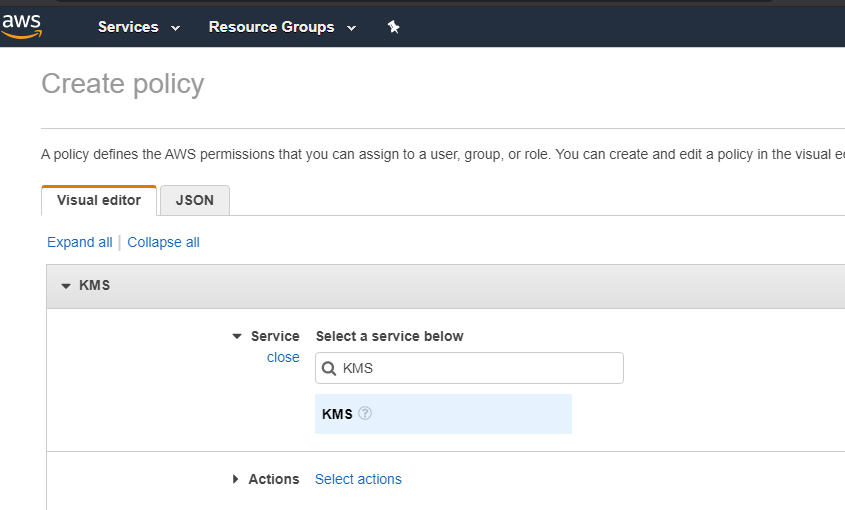
- In "Actions", expand "Read" and select `DescribeKey`.  Expand "Write" and select `Encrypt`, `Decrypt`, `GenerateDataKey`, `GenerateRandom`, `ReEncryptFrom`, `ReEncryptTo`
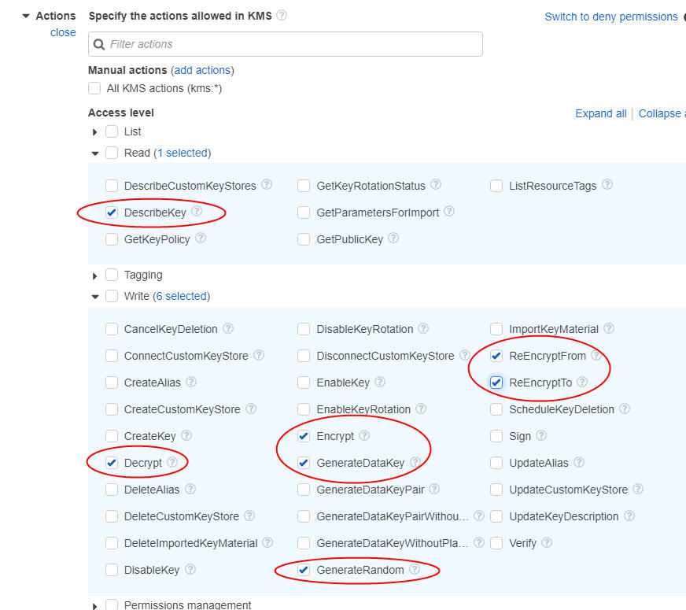
- In "Resources", you can either choose **Specific** to give access to specific resources (based on ARN) or **All resources**.  If you want to limit based on ARN, click on the **Add ARN** link.  The following popup will appear.  Copy the ARN (described below) and paste it to "Specify ARN for key", then click "Add"
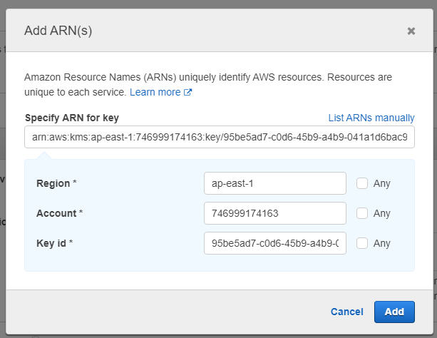
- To find ARN of a specific CMK, go to KMS panel (Click "Service" on the top navigation bar, search "kms", then click on "Key Management System")
- Click on **Customer managed keys** on the left sidebar, then click on a specific key.  ARN is at the right side of the page.
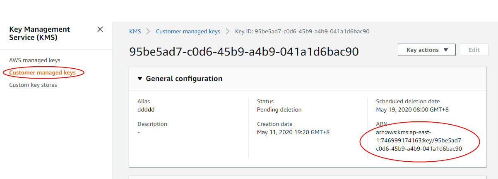
- "Any" in the popup box means allow all the Region/Account/Key id in the policy to do the things specified in "Action" above.
- If you only want to apply this policy in special condition, click **Specify request conditions (optional)** link
- Click **Review policy**
- Enter the name (required) of the policy.  If you want to review what is in the policy, click the "KMS" link in "Summary".  Then click **Create policy** to finish.
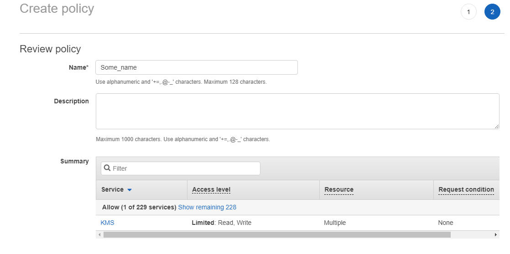
- A new policy is created.  You can always update it by clicking on it or remove the policy if it is not used anymore.
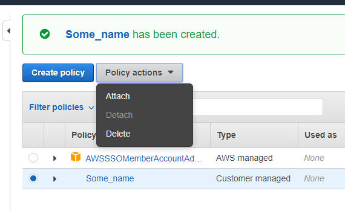

##### Create S3 policy

First, you need to find the ARN of your bucket

- In "Services" menu on the top navigation bar, search "S3", and click on the "S3" item in the result drop-down
- You should see a list of S3 bucket.  To get the ARN, select (**NOT** click on the name) the bucket and click the "Copy ARN" at the top.
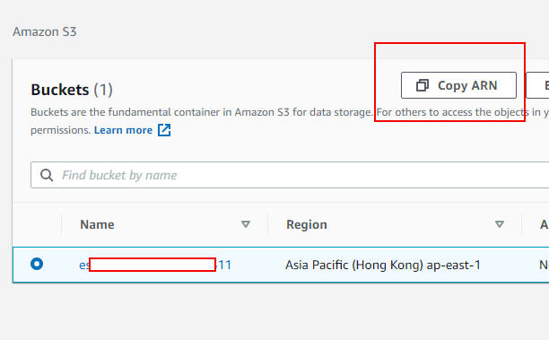

Now creating the policy.  Same steps applied in creating S3 policy.

- Go to **Policies** > **Create policy**
- Search `s3` and click on **S3** below
- In "Action" > Access level > Read, select **GetObject**
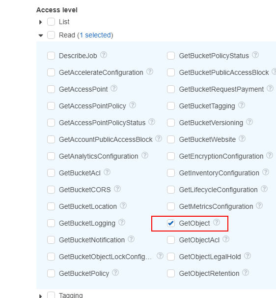
- In "Action" > Access level > Write, select **PutObject**
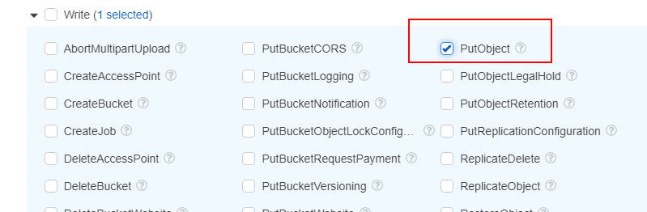
- In "Resources", again you can choose to specific bucket or all buckets.  If you want to specify bucket, just paste the ARN you copy above and paste it in "Specify ARN for object".  In case the ARN is invalid, you can always enter the "Bucket name".  You can also specify policy to specific object name, or check "Any" to allow all access.  When completed, click "Add"
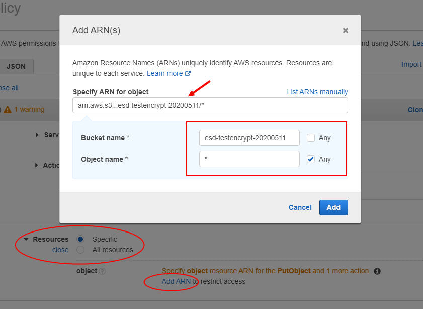
- Click "Review policy", enter the policy name and click "Create policy" button, just like creating KMS policy.

#### Set up specific amazon user

- Click the blue "Add user" button to start adding user
- Enter user name and check "Programmatic access", then click "Next: Permission"
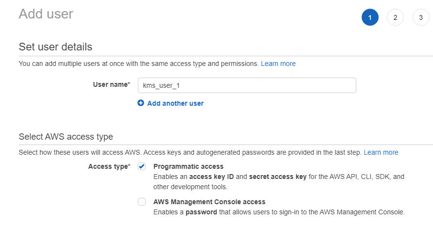
- Select "Attach existing policies directly", then search for the policy name you just created, then click **Next: Tags**
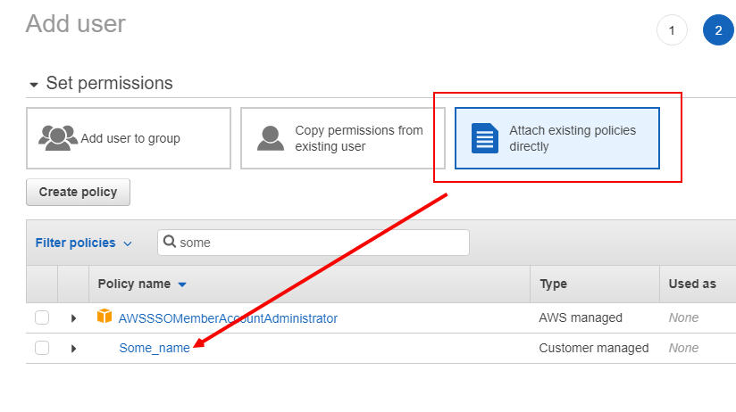
- Create tag is optional.  It is only used to identify, using key-value pair, what this user is about.  Click **Next: Review** when done
- You can review the details in this page.  If everything is fine, click **Create user**
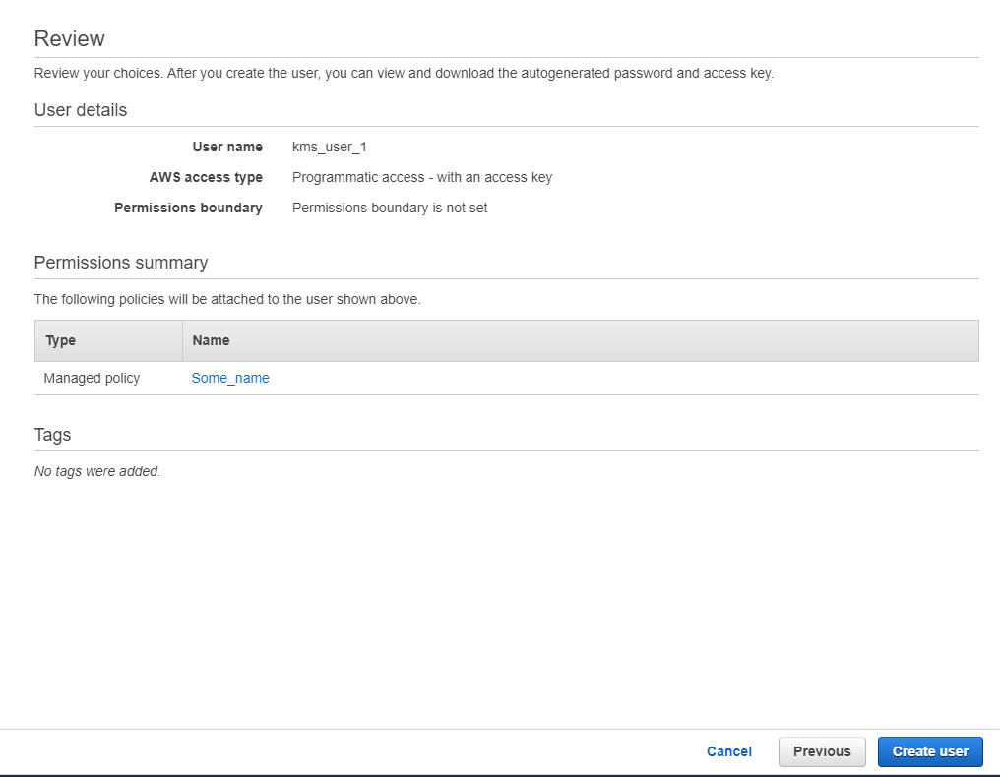
- **This page is important**: You can get the "Access key ID" and "Secret access key" here.  It is required to be defined in `.env` file.  You can click the **Show** link under "Secret access key" to copy the secret access key.  "Secret access key" can only be seen **ONCE**.
- If you lose this key, you need to re-create the access key.  In the "Users" page select a specific user.  Then in the Summary page select "Security credentials" tab, below you should see a section called "Access keys".  Click on the "Create access key" to create one, like below
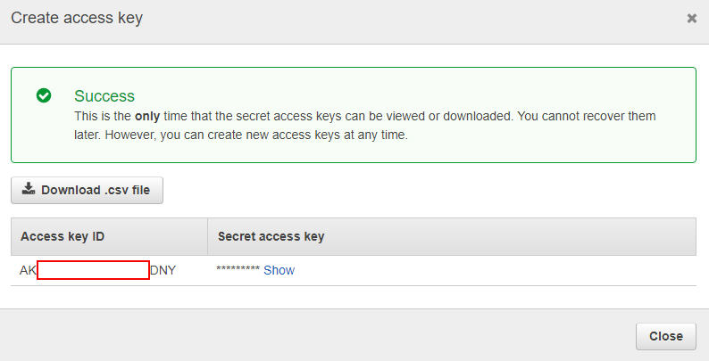
- Each user can only have 2 access keys.  If for some unknown reason you need more than 2, you need to click on the X button on the right of the key to remove it.  Using "Make inactive" will not work.

#### Apply Permissions policies to user

Now it is time to apply policy to your newly created user.

- Select the specific user ("Users" on the left, then click on specific user name)
- In the "Summary" page, click "Add permissions" in the "Permissions" tab
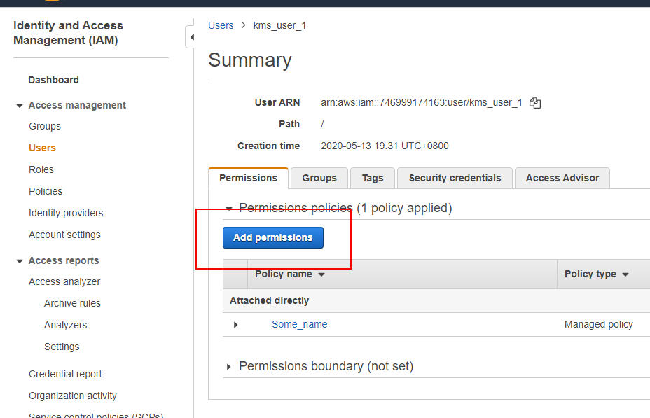
- In this page, select "Attach existing policies directly", then search for the policy you just created, check the box and click "Next: Review"
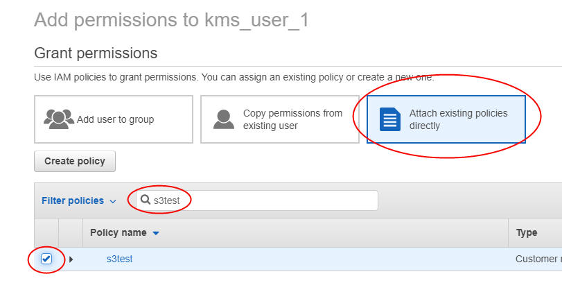
- Review your permission, and click "Add permissions" at the bottom right hand corner to finish.
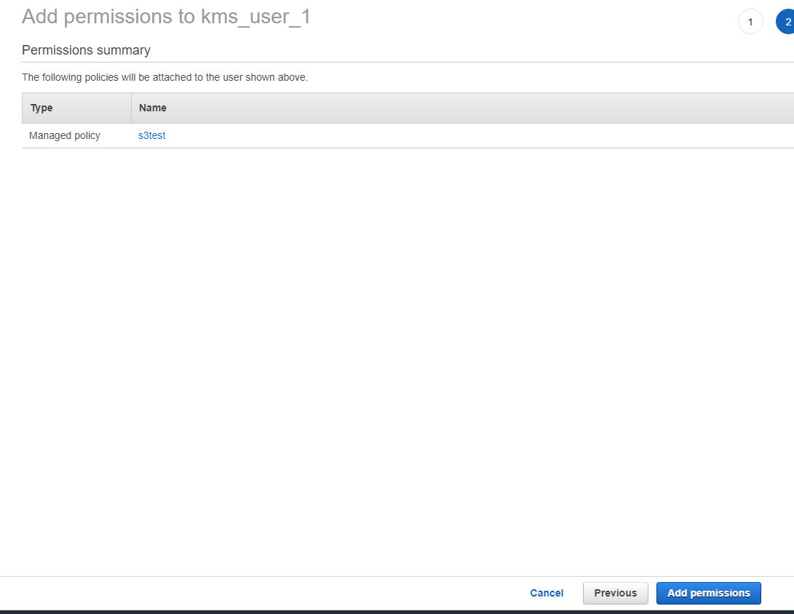
- You should see a new "Permission" applied to this user.
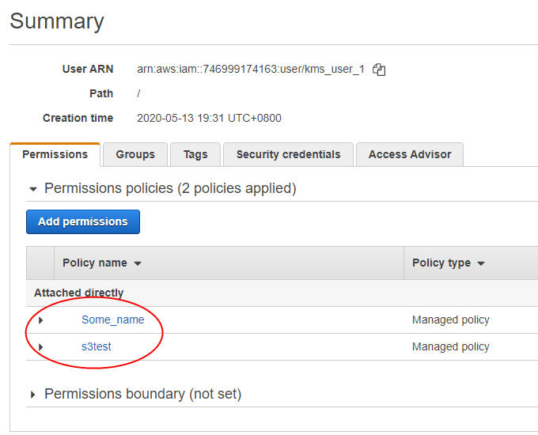

Hope it helps someone.